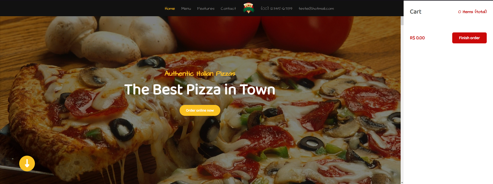
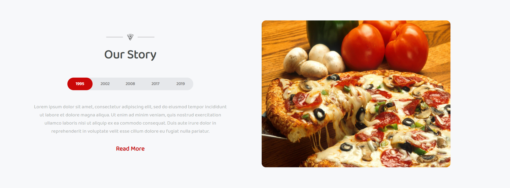
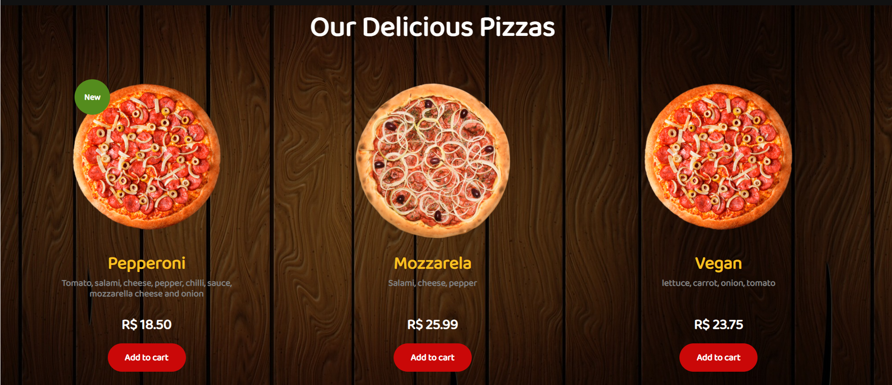
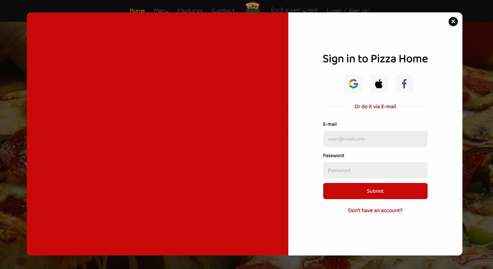

# **Pizza Home**

Um site feito para uma Pizzaria mostrando para o usuário um pouco mais sobre o restaurante e alguns de seus produtos,
com conexão à uma APi feito em Node e possibilita o usuário se cadastrar e fazer pedidos.

-- --

## **Screenshots**

-- --

## **Features**

- Modal Form de Login e Cadastro
- Adicionar produto ao Cart
- Editar o produto já no Cart (aumentar / diminuir quantidade e excluir)

-- --

## **Getting Started**

## *Abra o Prompt de Comando*

    git clone https://github.com/MatheusGomesRocha/pizzaria_react

    cd pizzaria_react && npm install`

## *Abra um novo Prompt de Comando*

    cd path/pizzaria_react && npm start
    
-- --

## **Tecnologia usada**

- React

-- --
## Meta

- Matheus Gomes
- Email - matheusgomes192@hotmail.com
- Linkedin - https://www.linkedin.com/in/matheus-gomes-2a61a8190/ 
